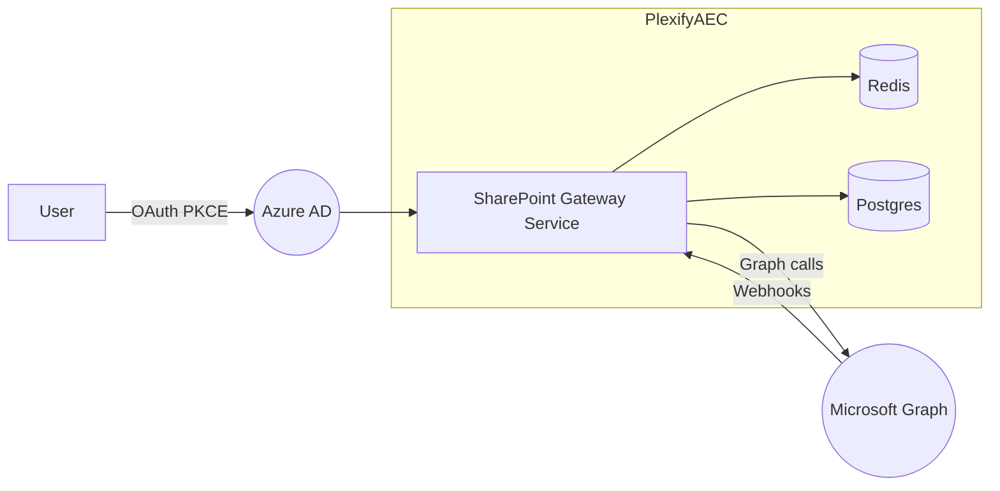

# 1  Scope  
Deliver a **first-class SharePoint connector** supporting:

* OAuth2 (Microsoft identity)  
* Bi-directional document CRUD & version history  
* Delta-based incremental sync (< 2 min latency)  
* Webhook change notifications  
* Permission mapping to Plexify **RBAC**  
* Evidence-link deep-links (`/sites/{site-id}/drive/items/{item-id}`)  
* Error/throttle resilience & telemetry

Parity level = 100 % of capabilities offered by existing Autodesk ACC connector.

---

# 2  Architecture Overview  



---

# 3  Authentication & Authorisation  

| Item | Detail |
|------|--------|
| Flow | OAuth 2.0 Authorization Code w/ PKCE + offline_access |
| Tenant types | Azure AD multi-tenant; admin-consent model |
| Redirect URI | `https://{env}.plexifyaec.com/api/integrations/sharepoint/oauth/callback` |
| Token storage | Encrypted (AES-256) in Vault, refresh token rotated every 45 days |
| Required Scopes | `Sites.ReadWrite.All`, `Files.ReadWrite.All`, `offline_access`, `User.Read` |
| RBAC Mapping | Azure role ➜ Plexify role<br>• `Site Owner` → Admin<br>• `Edit` → PM<br>• `Read` → Reviewer/Viewer |

### Auth Sequence  
1. User clicks “Connect SharePoint”.  
2. Gateway generates `code_verifier` + `code_challenge`, redirects to Microsoft login.  
3. Upon grant, gateway exchanges code → access & refresh tokens, stores secrets.  
4. Background job validates scope coverage; on partial scope, connector flagged “Degraded”.

---

# 4  API Endpoints (Gateway) v1  

| Method | Path | Description |
|--------|------|-------------|
| GET | `/integrations/sharepoint/status` | Connection health & last-sync stats |
| POST | `/integrations/sharepoint/connect` | Initiate OAuth |
| POST | `/integrations/sharepoint/webhook` | Microsoft change notification receiver |
| GET | `/projects/{pid}/sharepoint/items` | List items (query params: `parentId`, `search`) |
| POST | `/projects/{pid}/sharepoint/items/{id}/download` | Signed URL for evidence |
| PATCH | `/projects/{pid}/sharepoint/items/{id}` | Update metadata/tags |
| DELETE | `/projects/{pid}/sharepoint/items/{id}` | Delete / recycle |

_OpenAPI changes tracked in **docs/api/openapi.yaml**._

---

# 5  Graph Endpoints Used  

| Use-Case | Endpoint | Notes |
|----------|----------|-------|
| Enumerate Sites | `GET /sites?search=*jail*` | Initial discovery |
| Drives in Site | `GET /sites/{site-id}/drives` | One drive per doc lib |
| List Items | `GET /drives/{drive-id}/root/children` | Pagination 200 items |
| Delta | `GET /drives/{drive-id}/root/delta` | Token persisted for each drive |
| Download | `GET /drives/{drive-id}/items/{item-id}/content` | Generates pre-auth URL |
| Upload | `PUT /drives/{drive-id}/items/{parent-id}:/{filename}:/content` | 4 MiB simple; >4 MiB resumable |
| Versions | `GET /drives/{drive-id}/items/{item-id}/versions` | Map to Plexify versions |
| Webhook Subscription | `POST /subscriptions` | Resource = `/drives/{drive-id}/root`, TTL 43200 s |

---

# 6  Sync Model  

| Phase | Action | Detail |
|-------|--------|--------|
| **Back-fill** | Parallel crawl of drives (10 workers) | Respect 10 req/s burst |
| **Incremental** | Delta link polling every 5 min | Merge with webhook pushes |
| **Conflict** | Last-write-wins by `lastModifiedDateTime`; capture diff in `sync_conflicts` table |
| **Deletion** | If item `deleted: {}` in delta payload → mark `is_deleted` in DB |

Tables:

* `sp_sites(id, name, webUrl, tenantId)`  
* `sp_items(id, driveId, parentId, name, eTag, size, checksum, lastModified, metadata JSONB, project_id)`  
* `sp_sync_state(driveId, deltaToken, lastSync)`  

---

# 7  Webhooks  

| Field | Value |
|-------|-------|
| Callback URL | `/integrations/sharepoint/webhook` |
| Validation | Respond 200 w/ `validationToken` within 10 s |
| TTL Renewal Cron | Refresh 12 h prior to expiry |
| Security | HMAC `clientState` secret validated |

Failure handling → push to `dead_letter` queue → retries 3/5/15 min.

---

# 8  Rate Limits & Throttling  

| Limit | Strategy |
|-------|----------|
| 10,000 req / 10 min (tenant) | Adaptive concurrency (token bucket 100) |
| 4 MiB upload simple | >4 MiB uses chunked *resumable* |
| 429 / 503 | Exponential back-off (1 s – 32 s) with `Retry-After` header |
| Subscription cap 1000 | One subscription per drive; combine small drives |

Telemetry: Prometheus `graph_requests_total`, `graph_rate_limited_total`, `avg_retry`.

---

# 9  Data Schema (Plexify)  

```sql
CREATE TABLE sharepoint_files (
  id UUID PRIMARY KEY,
  drive_id TEXT,
  site_id TEXT,
  project_id UUID REFERENCES projects(id),
  name TEXT,
  path TEXT,
  size BIGINT,
  etag TEXT,
  version INT,
  mime_type TEXT,
  last_modified TIMESTAMPTZ,
  checksum TEXT,
  metadata JSONB,
  is_deleted BOOLEAN DEFAULT FALSE,
  created_at TIMESTAMPTZ DEFAULT now(),
  updated_at TIMESTAMPTZ DEFAULT now()
);
```

Indices on `(project_id, path)`, `(drive_id, delta_cursor)`.

---

# 10  Error Cases  

| Code | Scenario | Handling |
|------|----------|----------|
| 401 | Refresh token expired / revoked | Mark connector “Disconnected”; prompt re-auth |
| 403 | User lacks drive permission | Skip item; log to `sync_errors` |
| 404 | Item deleted mid-sync | Soft-delete local row |
| 409 | Version conflict on upload | Retry with new eTag; create conflict entry |
| 429 | Rate limit | See §8 |
| 5xx | Graph service outage | Circuit breaker after 3 failures |

---

# 11  Test Matrix  

| Layer | Tool | Scenario |
|-------|------|----------|
| Unit | Jest | OAuth helper, delta parser, ACL mapper |
| Contract | **Pact** | `/sites`, `/drives/*/delta` responses |
| Integration | **TestContainers** + **MS Graph Mock** | Back-fill 1 k files |
| e2e | Cypress | OAuth connect UI → evidence download |
| Chaos | k6 + Fault injection | 20 % 429 error burst |
| Security | ZAP | Token leakage, callback injection |

Coverage target: **95 % unit**, **90 % contract**, **80 % integration**.

---

# 12  Runbook  

| Procedure | Steps |
|-----------|-------|
| **On-call triage 5xx** | 1. Check Graph status page.<br>2. Verify circuit-breaker metrics.<br>3. If >15 min, switch to back-off 10 min; post status in #ops-alerts. |
| **Token refresh failure** | Run `/admin/sharepoint/reconnect`, user re-auths, verify `status` endpoint OK. |
| **Webhook validation failed** | Inspect `dead_letter`; redeploy subscription via `spgw cron --repair`. |
| **Data re-sync** | `plexify spgw resync --drive {id} --from '2025-01-01'`. |
| **Quota breach** | Scale pods from 2→4; raise token bucket to 200; monitor. |

SLOs:

* **Sync Freshness** 95 th < 2 min  
* **Evidence Download** 95 th < 800 ms  
* **Error Budget** < 1 % failed requests / month  

---

# 13  Future Enhancements  

* **Selective Sync Filters** (folders or metadata)  
* **Graph Search API** integration for federated evidence lookup  
* **IRM-protected file support** (requires Azure RMS decrypt)  

---

# 14  Open Questions  

1. Will agency users authenticate with separate Azure tenants?  
2. Need official guidance on SharePoint data residency for NYC projects?  

---

*End of spec – subject to Architecture Council review.*
